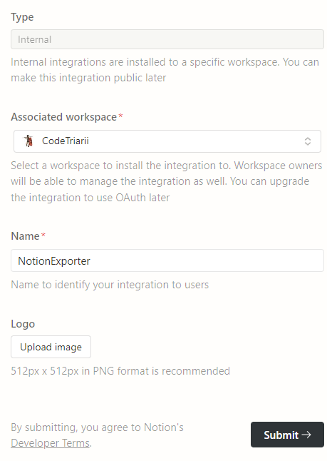
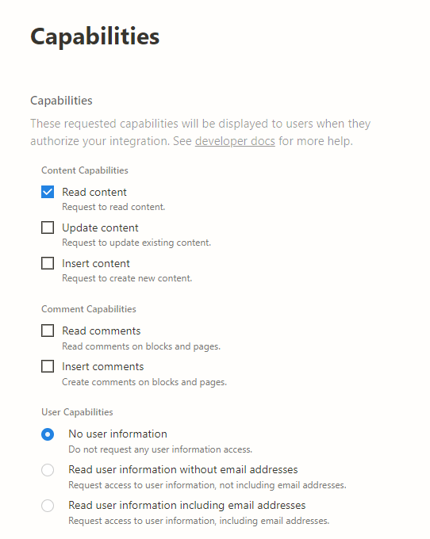
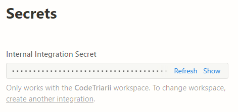
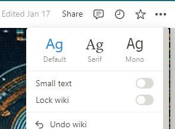
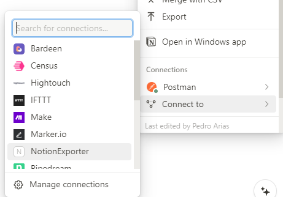

# Notion Integration

Based on [Notion Integration walkthrough](https://developers.notion.com/docs/create-a-notion-integration), we need to prepare the environment for the integration to be able to operate.

## Create Notion integration

Navigate to [Notion My integrations page](https://www.notion.so/my-integrations) to be able generate a new integration.

**Things to consider**:

- Unique identifier for the integration. In our case `NotionExporter`.
- The Associated workspace: this will be your space.

## Defining the capabilities

For this integration to be able to work, you may only need the following caps:

- `Read content` - To be able to retrieve the pages.

## Retrieving Notion secret

After creating the integration, you will be provided with a Secret (API Key) to be able to work against the API.

## Sharing the pages and databases with the connection

Go to the notion parent page and databases that you want to export and share:

- Navigate to the root page of you wiki in Notion.
- Click on the `...` on the right corner of the page.

